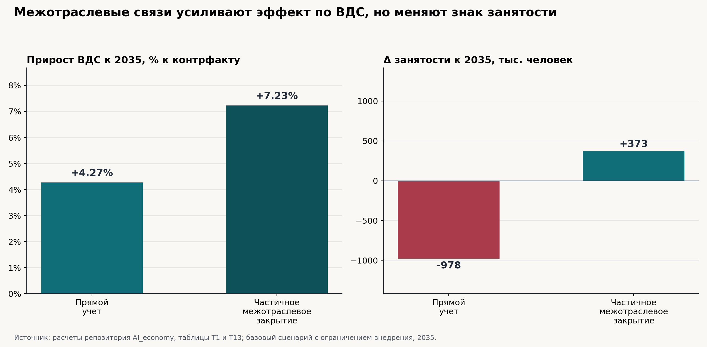
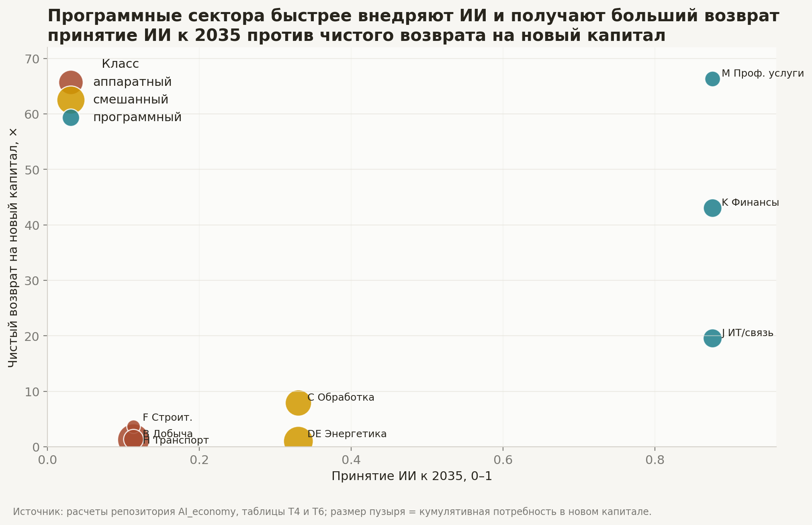
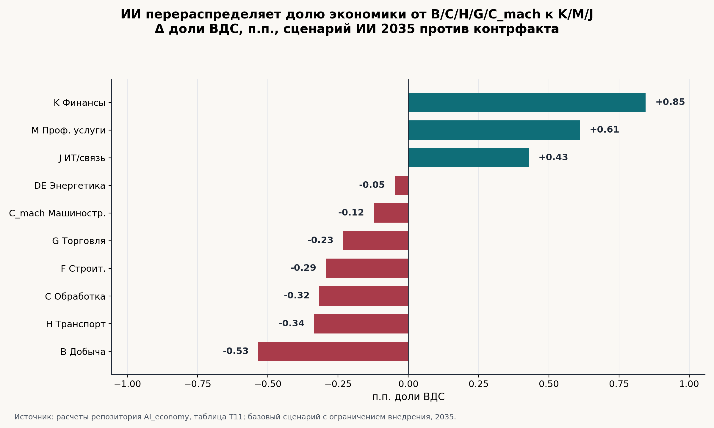
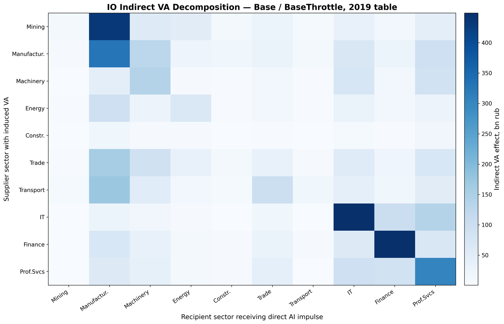
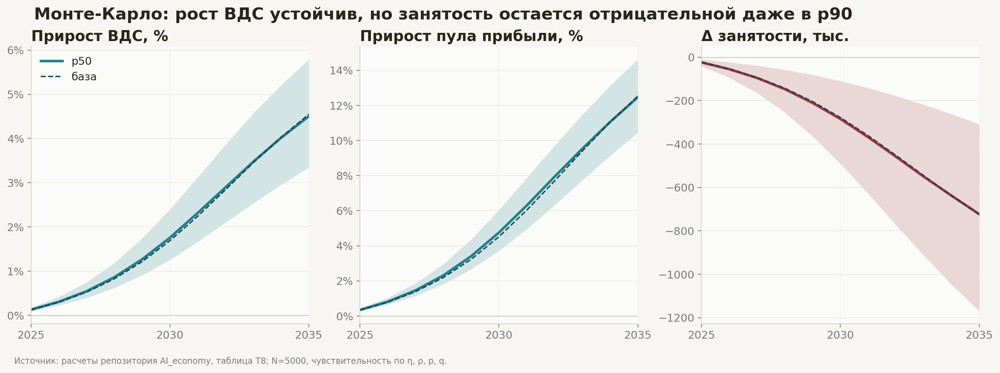
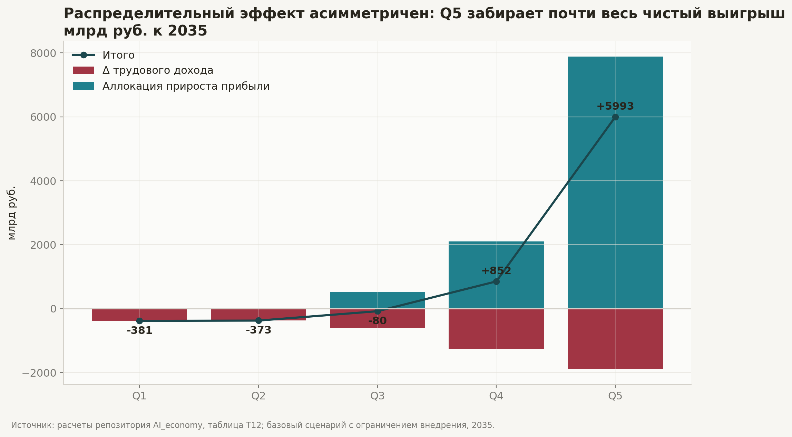

# ИИ и структура экономики России: операционный 2030 и стратегический 2035 горизонты

Краткая аналитическая записка по результатам репозитория [AI_economy](https://github.com/Theclimateguy/AI_economy)

## Резюме

Исследование отвечает на практический вопрос: какие сектора российской экономики выигрывают от внедрения ИИ к 2030 году (операционный горизонт) и к 2035 году (стратегический горизонт), где возникает вытеснение труда и насколько вывод устойчив к параметрам модели. Базовый результат теперь основан на десяти секторах, включая отдельно выделенные G (оптовая и розничная торговля) и C_mach (машиностроение, ОКВЭД 26–30): к 2030 году ВДС выше контрфакта на 1,55%, пул прибыли выше на 4,26%, занятость ниже на 361 тыс. человек; к 2035 году ВДС +4,27%, пул прибыли +11,98%, занятость −978 тыс. При частичном межотраслевом закрытии в 2035 году эффект ВДС повышается до 7,23%, а знак занятости меняется на +373 тыс. — прямой учет фиксирует вытеснение труда, межотраслевой спрос его частично компенсирует.

Главная содержательная находка не в том, что ИИ «ускоряет рост», а в том, что он меняет структуру выигрышей по двум горизонтам по-разному. К 2030 году большинство секторов еще находятся в фазе раннего внедрения (A₂₀₃₀ ≈ 0,38 для программного класса и около 0,11 для индустриального и торгового), и эффект концентрируется в финансах, профессиональных услугах и ИТ/связи. К 2035 году принятие в программных секторах достигает A₂₀₃₅ ≈ 0,88, чистый возврат на новый капитал составляет 19,6–66,3×, доля ВДС растет в K на +0,85 п.п., в M на +0,61 п.п., в J на +0,43 п.п. Сырьевое и индустриально-логистическое ядро сохраняет абсолютный масштаб, но теряет относительную долю: добыча −0,53 п.п., обработка −0,32 п.п., транспорт −0,34 п.п., машиностроение −0,12 п.п., торговля −0,23 п.п.

Риск модели социальный, а не только макроэкономический. В базовом сценарии 2035 года трудовой доход падает на 7,25%, тогда как пул прибыли растет на 11,98%; распределительный слой дает рост proxy Gini с 0,290 до 0,380. Q5 получает +5993 млрд руб. чистого эффекта, Q1 и Q2 теряют −381 и −373 млрд руб. соответственно. Поэтому главный управленческий вывод: ИИ-стратегия без политики распределения и переобучения повышает ВДС, но усиливает концентрацию доходов.

Внешняя литература задает широкий коридор для интерпретации. McKinsey оценивает годовой мировой потенциал генеративного ИИ в $2,6–4,4 трлн по 63 прикладным сценариям и $6,1–7,9 трлн с учетом широкой продуктивности, а Goldman Sachs оценивает долгосрочный прирост мирового ВВП примерно в 7% и экспозицию до 300 млн рабочих мест к автоматизации ([McKinsey](https://www.mckinsey.com/capabilities/tech-and-ai/our-insights/the-economic-potential-of-generative-ai-the-next-productivity-frontier), [Goldman Sachs](https://www.goldmansachs.com/insights/articles/generative-ai-could-raise-global-gdp-by-7-percent)). Более консервативная академическая линия указывает, что 10-летний эффект может быть существенно ниже: Acemoglu оценивает прирост совокупной факторной производительности примерно до 0,71% и ВВП примерно до 1,1–1,8% при подходе, основанном на структуре задач ([MIT Economics](https://economics.mit.edu/sites/default/files/2024-04/The%20Simple%20Macroeconomics%20of%20AI.pdf)). Российский результат проекта находится между этими полюсами: выше академического «скромного» сценария, но ниже глобальных верхних оценок консалтинга и инвестбанков.

## Задача, гипотеза, результат

| Блок | Задача | Гипотеза | Результат |
| --- | --- | --- | --- |
| Историческая проверка | Найти переносимые коэффициенты из ИКТ-эпохи | Устойчивые исторические коэффициенты можно перенести на ИИ | Не подтверждено: 0 из 4 инвариантов прошли строгий отбор; остался только механизм возврата маржи к среднему |
| Диффузия ИИ | Оценить принятие ИИ в секторах к 2030 и 2035 году | Класс технологии определяет скорость внедрения | Подтверждено: программный класс достигает A₂₀₃₀ 0,384 и A₂₀₃₅ 0,876 до ограничений, аппаратный — 0,043 и 0,113 соответственно |
| Управляемое замедление | Учесть институциональные и капитальные тормоза | J, C_mach, C, K и DE имеют повышенный индекс давления | Подтверждено: MOS выше всего у J 0,637, C_mach 0,426, C 0,384, K 0,363, DE 0,339 |
| Макроучет | Перевести ИИ-шоки в ВДС, прибыль, труд и занятость на двух горизонтах | ИИ перераспределяет экономику к K/M/J | Подтверждено: к 2035 году K +0,85 п.п., M +0,61 п.п., J +0,43 п.п. доли ВДС |
| IO-закрытие | Проверить косвенные эффекты спроса | Прямой учет недооценивает макроэффект | Подтверждено: ВДС-эффект 2035 г. растет с 4,27% до 7,23%, занятость меняет знак с −978 тыс. до +373 тыс. |
| Распределительный слой | Оценить распределение выигрышей | Выгоды концентрируются наверху | Подтверждено: Q5 получает +5993 млрд руб., ΔGini +0,090 |

## Операционный горизонт 2030

Операционный горизонт 2030 нужен для решений, которые принимаются сегодня и оборачиваются в течение 4–6 лет: инвестиционные циклы в K/M/J, переобучение в G и в C_mach, бюджетирование амортизации основных фондов. Стратегический горизонт 2035 показывает, к какому равновесию ведет траектория, но не задает темпа исполнения.

| Показатель | 2030 (операционный) | 2035 (стратегический) |
| --- | --- | --- |
| ВДС-эффект, % | 1,55% | 4,27% |
| Занятость, прямой учёт, тыс. | -361 | -978 |
| Занятость с IO, тыс. | +149 (оценка по доле IO ≈ 41%) | +373 |
| Пул прибыли, % | 4,26% | 11,98% |
| Прирост произв. труда, % | 2,33% | 6,38% |
| Чистая стоимость после капекса, трлн руб. | 8,3 | 46,6 |

К 2030 году диффузия ИИ в программных секторах (K, M, J) достигает A₂₀₃₀ ≈ 0,384 — это репрезентативное среднее по классу `software` (одинаковое для K, M, J до применения управленческого замедления). В индустриально-сервисных секторах (C, C_mach, DE, G) A₂₀₃₀ ≈ 0,106, в аппаратных (B, F, H) — A₂₀₃₀ ≈ 0,043. Операционно значимые решения: инвестиции в K/M/J нужно делать уже в 2026–2027 годах, чтобы попасть в фазу ускоряющегося возврата на капитал; переобучение для G необходимо начинать не позже 2027–2028 годов, иначе вытеснение труда в торговле к 2035 году не будет компенсировано переходом в смежные сектора.

## Что показывает модель

### Прямой эффект: рост ВДС и прибыли при сжатии трудового дохода

В базовом сценарии с ограничением внедрения ИИ десять секторов проекта дают +2317 млрд руб. ВДС к 2030 году и +7570 млрд руб. к 2035 году, +3410 и +11 347 млрд руб. пула прибыли соответственно, а трудовой доход теряет −3883 и −5902 млрд руб. Совокупная чистая стоимость после капиталовложений к 2035 году составляет 46,6 трлн руб., что делает ИИ-шок экономически значимым даже в сценарии с управляемым торможением.

| Сценарий | ВДС 2030, % | ВДС 2035, % | Пул прибыли 2035, % | Трудовой доход 2035, % | Занятость 2035, тыс. | Производительность 2035, % | Чистая стоимость 2035, трлн руб. |
| --- | --- | --- | --- | --- | --- | --- | --- |
| База + ограничение | 1,55 | 4,27 | 11,98 | -7,25 | -978 | 6,38 | 46,6 |
| База без ограничения | 1,74 | 4,80 | 13,51 | -7,49 | -1077 | 7,15 | 52,4 |
| База + санкционный клин | 1,38 | 3,78 | 10,53 | -6,95 | -887 | 5,68 | 41,1 |
| База + ослабление санкций | 1,43 | 3,91 | 10,91 | -7,02 | -911 | 5,87 | 42,5 |
| Быстрое внедрение | 2,43 | 5,35 | 15,06 | -8,75 | -1362 | 8,34 | 65,5 |
| Фрикционное внедрение | 0,85 | 3,12 | 8,71 | -6,17 | -651 | 4,50 | 29,3 |

Внешние микроисследования поддерживают сам механизм продуктивности, хотя не доказывают российские параметры. В эксперименте Noy and Zhang с 453 специалистами ChatGPT сократил время выполнения письменных задач на 40% и повысил качество на 18%, а в NBER-исследовании Brynjolfsson, Li and Raymond по 5179 агентам клиентской поддержки доступ к ассистенту генеративного ИИ повысил производительность на 14% в среднем и на 34% у новичков и низкоквалифицированных работников ([Science](https://www.science.org/doi/10.1126/science.adh2586), [NBER](https://www.nber.org/papers/w31161)).

### Межотраслевой слой: прямой учет занижает ВДС-эффект

Частичное межотраслевое закрытие добавляет 5261 млрд руб. косвенного эффекта к 7570 млрд руб. прямого эффекта 2035 года, повышая итоговый прирост ВДС до 12 831 млрд руб., или 7,23% относительно контрфакта. Это ключевая поправка к прямому учету: при наличии спросовых связей ИИ не только вытесняет труд внутри отраслей, но и поддерживает занятость через смежные производственные цепочки.

| Сценарий | Прямой ВДС, млрд руб. | Косвенный ВДС, млрд руб. | Итого ВДС, млрд руб. | Итого, % | Занятость, прямой учет, тыс. | Занятость, IO, тыс. | Импорт, база | Импорт, санкции |
| --- | --- | --- | --- | --- | --- | --- | --- | --- |
| База + ограничение | 7570 | 5261 | 12831 | 7,23 | -978 | +373 | 1635 | 1480 |
| Санкционный клин | 6706 | 4677 | 11383 | 6,42 | -887 | +319 | 1454 | 1317 |
| Ослабление санкций | 6932 | 4828 | 11761 | 6,63 | -911 | +333 | 1502 | 1361 |

#### Топ-5 связок «поставщик → получатель» по поддержке занятости (2035, IO, базовый сценарий)

| Поставщик | Получатель | Косвенный ВДС, млрд руб. | Косвенная занятость, тыс. чел. |
| --- | --- | --- | --- |
| J ИТ и связь | J ИТ и связь | 449,1 | 100,1 |
| C Обработка | C Обработка | 329,2 | 89,8 |
| G Торговля | C Обработка | 157,9 | 81,0 |
| H Транспорт | C Обработка | 171,8 | 74,9 |
| M Проф. услуги | M Проф. услуги | 303,0 | 65,4 |

В шестую и седьмую позицию попадают связки «G → C_mach» (45,6 тыс. занятых через косвенный спрос машиностроения на услуги торговли) и «H → G» (42,7 тыс.). Это означает: внутренняя торговля и логистика являются основным «спросовым каналом» поддержки промышленности и машиностроения в IO-закрытии.

Эту оценку нельзя читать как полноценный результат модели общего равновесия. Она показывает направление и порядок эффекта, но не закрывает цены, замещение факторов, ставки, внешний сектор и вытеснение инвестиций или спроса.

## Где возникает выигрыш

### Три центра роста: финансы, профессиональные услуги, ИТ/связь

Программные сектора формируют ядро выигрыша: K, M и J одновременно имеют более высокое принятие ИИ, более высокий возврат на новый капитал и положительный сдвиг доли ВДС. Это соответствует внешним оценкам, где наибольшая доля потенциальной ценности генеративного ИИ приходится на интеллектуально насыщенные функции: клиентские операции, маркетинг и продажи, разработку программного обеспечения и НИОКР ([McKinsey](https://www.mckinsey.com/capabilities/tech-and-ai/our-insights/the-economic-potential-of-generative-ai-the-next-productivity-frontier)).

| Сектор | Класс | A₂₀₃₅ | Возврат, × | MOS | Δ доли ВДС 2035, п.п. | Δ прибыли 2035, млрд руб. | Δ занятости 2035, тыс. |
| --- | --- | --- | --- | --- | --- | --- | --- |
| K Финансы и страхование | программный | 0,88 | 43,0 | 0,36 | +0,85 | +4367 | -65 |
| M Профессиональные и научные услуги | программный | 0,88 | 66,3 | 0,17 | +0,61 | +2365 | -195 |
| J ИТ и связь | программный | 0,88 | 19,6 | 0,64 | +0,43 | +1591 | -157 |
| DE Энергетика и ЖКХ | смешанный | 0,33 | 1,0 | 0,34 | -0,05 | +180 | -34 |
| C_mach Машиностроение (ОКВЭД 26–30) | смешанный | 0,33 | 6,1 | 0,43 | -0,12 | +446 | -53 |
| G Оптовая и розничная торговля | смешанный | 0,33 | 15,9 | 0,12 | -0,23 | +796 | -156 |
| F Строительство | аппаратный | 0,11 | 3,6 | 0,20 | -0,29 | +43 | -40 |
| C Обрабатывающая промышленность (без машиностроения) | смешанный | 0,33 | 7,9 | 0,38 | -0,32 | +1184 | -138 |
| H Транспорт и логистика | аппаратный | 0,11 | 1,4 | 0,22 | -0,34 | +96 | -37 |
| B Добыча полезных ископаемых | аппаратный | 0,11 | 1,3 | 0,23 | -0,53 | +280 | -7 |

### Почему промышленность, торговля и добыча не исчезают, но теряют долю

Обработка, машиностроение, торговля и добыча остаются крупнейшими секторами в абсолютном выражении, однако их относительная доля снижается из-за более медленной диффузии, капитальной инерции и более низкого чистого возврата. Для C и C_mach результат особенно важен: суммарно они теряют 0,44 п.п. доли ВДС, но получают +1630 млрд руб. прироста пула прибыли. G теряет 0,23 п.п., но получает +796 млрд руб. прибыли при выраженном прямом сжатии занятости (−156 тыс.) — это и есть сектор, требующий приоритетного переобучения. Это не «поражение реального сектора», а сдвиг его роли: меньше доля в новой структуре, но больше абсолютная прибыль при высокой чувствительности к санкционному и инвестиционному контуру.

## Насколько устойчив вывод

Монте-Карло с 5000 прогонов показывает, что ключевой вывод по ВДС устойчив в разумном диапазоне параметров на обоих горизонтах. Распределения оценены отдельно для 2030 и 2035 годов.

| Показатель | Горизонт | p10 | p50 | p90 |
| --- | --- | --- | --- | --- |
| Прирост ВДС, % | 2030 | 1,19 | 1,63 | 2,18 |
| Прирост ВДС, % | 2035 | 3,24 | 4,26 | 5,42 |
| Прирост пула прибыли, % | 2030 | 3,57 | 4,48 | 5,65 |
| Прирост пула прибыли, % | 2035 | 10,21 | 12,01 | 13,94 |
| Δ занятости, тыс. | 2030 | -612 | -372 | -163 |
| Δ занятости, тыс. | 2035 | -1550 | -972 | -450 |

Последнее важно: даже в благоприятной p90-точке занятость остается ниже контрфакта на обоих горизонтах, если смотреть прямой учет без компенсации межотраслевого спроса.

Внешние оценки экспозиции занятости подтверждают, что «экспозиция» не равна автоматическому увольнению. IMF оценивает, что почти 40% мировой занятости подвержено воздействию ИИ, около 60% в развитых экономиках, 40% в развивающихся рынках и 26% в странах с низким доходом; ILO-NASK в обновленном индексе оценивает, что 24% глобальной занятости находится в профессиях с некоторой экспозицией к генеративному ИИ, но только 3,3% попадает в высшую категорию экспозиции ([IMF](https://www.imf.org/en/Blogs/Articles/2024/01/14/ai-will-transform-the-global-economy-lets-make-sure-it-benefits-humanity), [ILO-NASK](https://webapps.ilo.org/static/english/intserv/working-papers/wp140/index.html)). Для российской модели это означает: правильная интерпретация −978 тыс. (2035) и −361 тыс. (2030) — не «ИИ уничтожит рабочие места», а «без переобучения и спросового замыкания прямой трудовой слой оказывается системно отрицательным».

## Распределительный риск

В базовом сценарии 2035 года потери трудового дохода распределены шире, чем прирост прибыли. Q1 и Q2 не получают аллокации прироста капитального дохода и фиксируют чистый минус; Q3 почти выходит в ноль за счет частичной аллокации прибыли; Q4 и особенно Q5 становятся чистыми бенефициарами. Итоговый proxy Gini растет на 0,090, с 0,290 до 0,380.

| Квинтиль | Δ занятости, тыс. | Δ трудового дохода | Аллокация прибыли | Итого, млрд руб. |
| --- | --- | --- | --- | --- |
| Q1 | -40 | -381 | +0 | -381 |
| Q2 | -36 | -373 | +0 | -373 |
| Q3 | -103 | -606 | +525 | -80 |
| Q4 | -156 | -1248 | +2101 | +852 |
| Q5 | -391 | -1884 | +7877 | +5993 |

Этот результат согласуется с предупреждением IMF: ИИ может повышать производительность и рост, но без социальных страховочных механизмов и переобучения способен усиливать неравенство и социальное напряжение ([IMF](https://www.imf.org/en/Blogs/Articles/2024/01/14/ai-will-transform-the-global-economy-lets-make-sure-it-benefits-humanity)). Одновременно он отличается от отдельных микроэкспериментов, где генеративный ИИ сжимает разрыв производительности между работниками, как у Noy and Zhang и Brynjolfsson et al.; причина в том, что микроэффект «менее опытные догоняют» не гарантирует макрораспределение дохода, если собственность на капитал и пул прибыли сконцентрированы ([Science](https://www.science.org/doi/10.1126/science.adh2586), [NBER](https://www.nber.org/papers/w31161)).

## Управленческие выводы

- **Инвестировать в K/M/J уже в операционном горизонте 2030**: это сектора, где совпадают высокая скорость внедрения, высокий возврат на капитал и положительный структурный сдвиг. Финансы дают крупнейший прирост прибыли, профессиональные услуги имеют максимальный возврат, ИТ/связь имеет высокий MOS и потому нуждается в отдельном контуре снятия ограничений.
- **Запустить переобучение в G и подъемный контур в C_mach**: торговля концентрирует крупнейшее прямое сжатие занятости среди индустриально-сервисных секторов, машиностроение имеет средний MOS и высокий косвенный спрос со стороны G и H. Решения в обоих секторах нужны до 2027–2028 годов.
- **Не трактовать C/B/H/C_mach/G как «проигравших» буквально**: они теряют долю, но не обязательно абсолютную прибыль. Для них важнее не замещение труда само по себе, а капиталовложения, импортные ограничения, производственные связки и скорость обновления основных фондов.
- **Разделять прямой и IO-эффект**: прямой слой нужен для оценки риска занятости, IO-слой нужен для оценки макроспроса. Смешивание этих двух уровней даст неверный вывод: либо чрезмерный пессимизм по занятости, либо чрезмерный оптимизм по социальной цене.
- **Делать ИИ-политику распределительной по дизайну**: без налогово-трансфертного, образовательного или механизма распределения собственности модель дает рост Gini. Главная мера риска: не только «сколько ВДС добавлено», но и «какая доля прироста пула прибыли возвращается в Q1–Q4».
- **Следующий аналитический шаг**: заменить распределительный proxy на микроданные RLMS/LFS, подключить российскую матрицу профессий ОКЗ × ОКВЭД, а межотраслевой слой расширить до модели общего равновесия или хотя бы модели, чувствительной к ценам и замещению факторов.

## Допущения и ограничения

- **Сценарная природа эффекта**: ΔsL и шоки производительности являются калиброванными сценарными якорями, а не оцененными каузальными эластичностями ИИ на российских отраслевых данных.
- **Неполное макрозакрытие**: модель включает прямой учет и частичный межотраслевой слой Леонтьева, но не закрывает цены, замещение факторов, процентные ставки, валютный курс, демографию, внешний спрос и вытеснение инвестиций или спроса.
- **Данные по труду**: ФОТ построен как proxy через занятость, среднюю зарплату и 12 месяцев; микроданные домохозяйств и индивидуальных зарплат не используются.
- **Управляемое замедление**: MOS является индикатором давления и инерции, а не доказательством намеренного замедления внедрения. Для J и M остается риск слабого сопоставления старых NACE-кодов.
- **Санкционный слой**: импортные фрикции и санкционный клин заданы как первичный proxy на основе отраслевых признаков, а не как отдельная модель международной торговли.
- **Денежная база**: денежные величины трактуются в рублях baseline 2024; инфляционная и курсовая динамика не моделируется.
- **Горизонты**: модель рассчитана на 2025–2035 годы и явно различает операционный горизонт 2030 и стратегический 2035. Результаты после 2035 года не экстраполируются.
- **G и C_mach используют частичный proxy**: торговля — Russia KLEMS 50t52 (прямое соответствие), машиностроение — долевой proxy ~21% от агрегата C на основе данных формы П-1; для обоих секторов повышенная неопределенность по A_t и delta_sL вне p10–p90 диапазона Монте-Карло.
