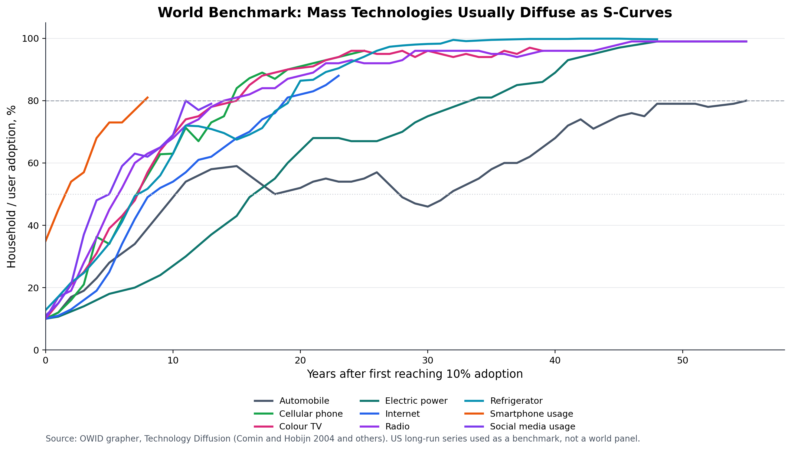
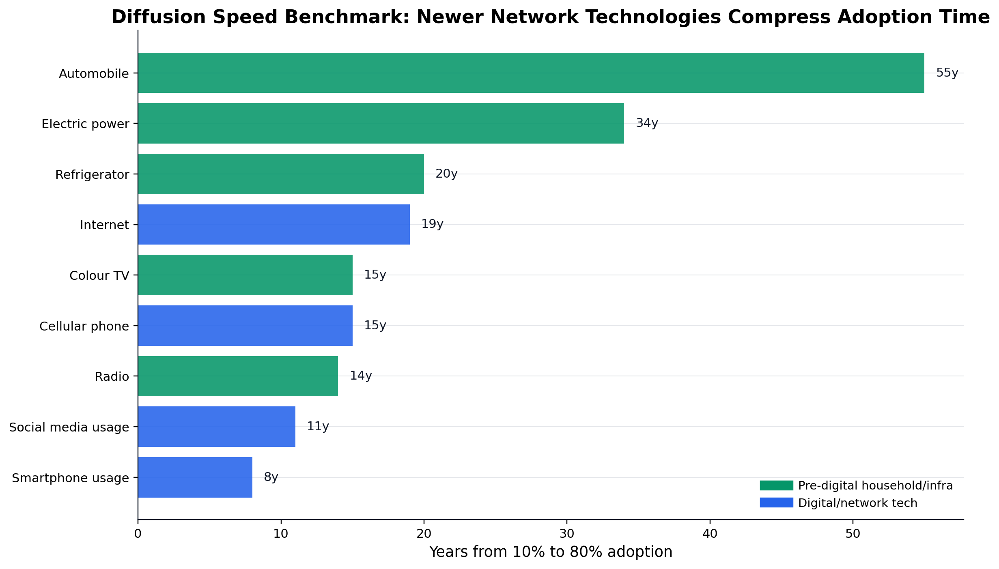
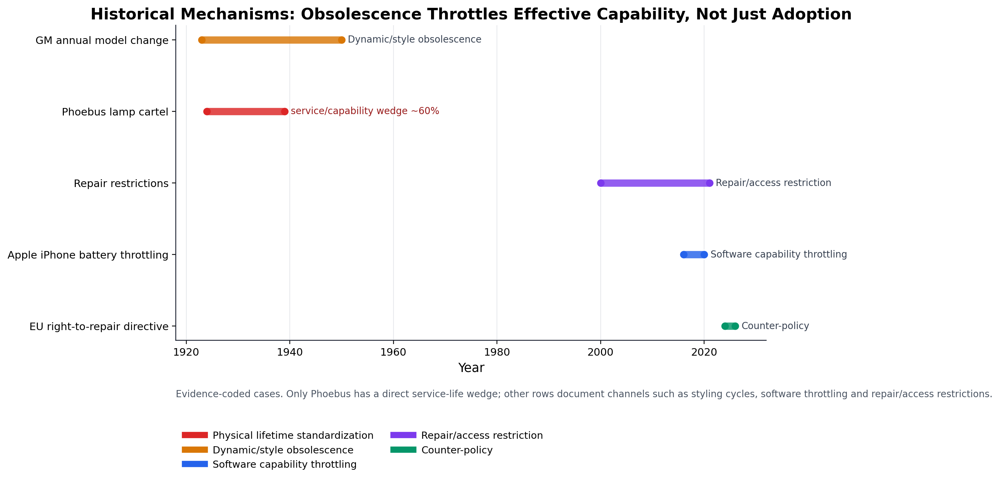
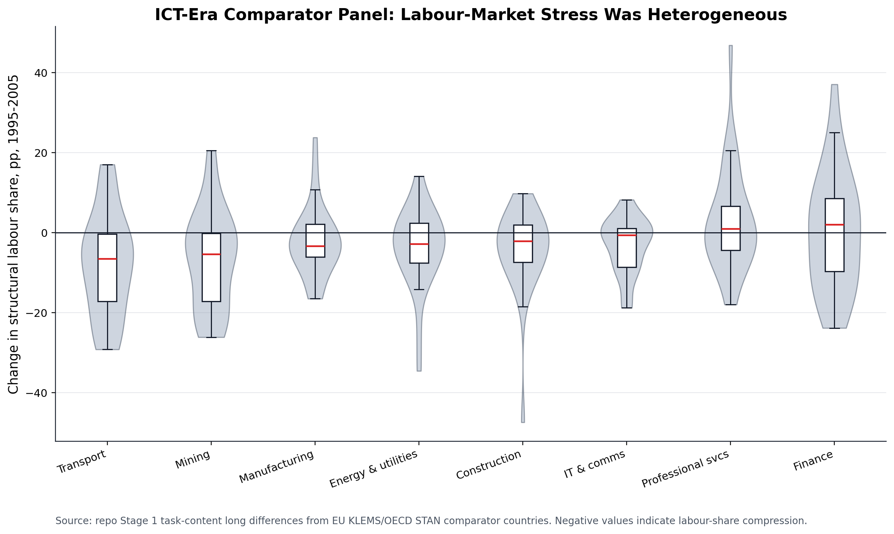
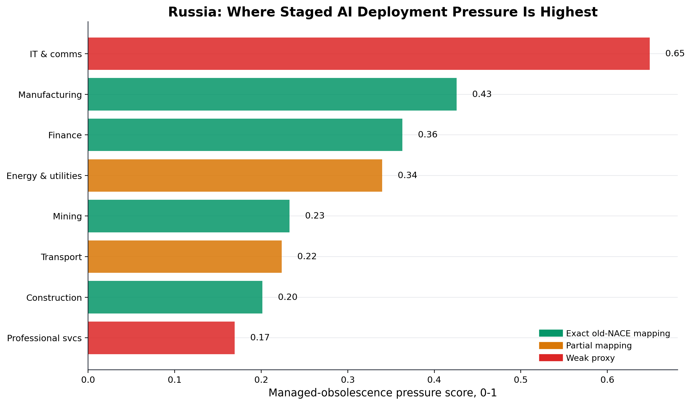
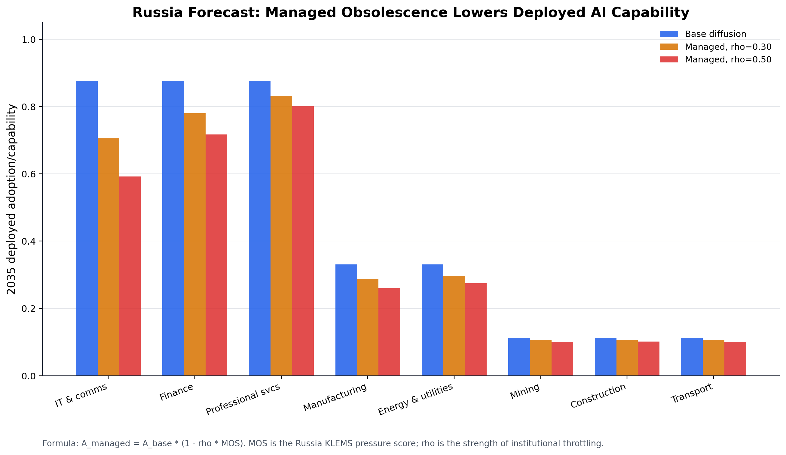
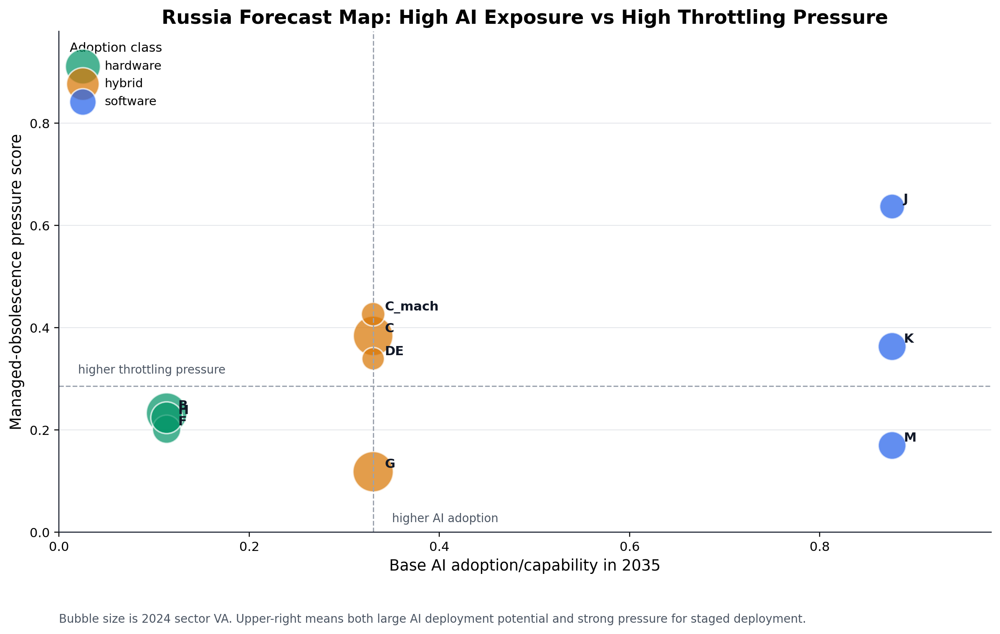

# Managed Obsolescence Figures

## Постановка

Цель набора графиков — отделить три объекта:

1. нормальная технологическая диффузия;
2. исторические каналы planned / managed obsolescence;
3. прогнозный wedge для РФ.

Ключевая формула остается:

$$
a_{s,t} = q_t A_{s,t}(1-\tau_{s,t})
$$

где $q_t$ — frontier capability, $A_{s,t}$ — sector adoption, $\tau_{s,t}$ — managed-obsolescence / throttling wedge. В графиках для РФ используется first-pass:

$$
A^{managed}_{s,2035} = A^{base}_{s,2035}(1-\rho MOS_s)
$$

где $MOS_s$ — pressure score из Russia KLEMS, $\rho \in \{0.30, 0.50\}$.

## Графики

### 1. Нормальный benchmark S-кривых



Этот график нужен как null model: массовые технологии обычно проходят S-кривую проникновения. Для ИИ это означает, что при отсутствии throttling ожидалась бы ускоренная network-software diffusion, ближе к internet / smartphone / social media, чем к automobile / electricity.

### 2. Скорость диффузии технологий



Новые network technologies быстрее доходят от 10% до 80%. Это усиливает риск labour backlash: чем короче окно адаптации, тем выше стимул к staged deployment через регулирование, compatibility limits, access tiers или model gating.

### 3. Исторические механизмы obsolescence



Здесь важно не переутверждать. Прямой service-life wedge хорошо измерим у Phoebus. GM лучше трактовать как dynamic obsolescence, а Apple / repair restrictions — как software and access throttling channels. Вывод: obsolescence часто сдерживает не headline adoption, а effective service flow:

$$
\text{effective service} = \text{adoption} \times \text{durability/capability/access}
$$

### 4. Международный трудовой стресс ICT-эпохи



Comparator panel показывает, что ICT-шок 1995-2005 не дал универсальной beta. Сектора имели разные распределения $\Delta s^L$. Это поддерживает сценарную, а не механически регрессионную постановку для ИИ.

### 5. РФ: sector pressure score



Самый высокий score у `J`, но это weak legacy proxy в Russia KLEMS. Среди чисто сопоставимых отраслей центральный сектор — `C` manufacturing: высокий productivity-hours gap, capital-labour gap и сжатие занятости. Для `B` есть отдельная осторожность из-за нефтегазовой статистики и transfer pricing.

### 6. РФ: forecast with managed deployment



Если добавить managed-obsolescence wedge, forecast меняется несимметрично. В software sectors headline adoption остается высокой, но deployed capability существенно режется при высоком $MOS_s$. В hardware sectors baseline adoption и так низкий, поэтому абсолютный эффект wedge меньше.

### 7. РФ: карта риска throttling



Upper-right quadrant — сектора, где одновременно высоки AI adoption potential и pressure for staged deployment. В текущей версии туда попадают `J` и `M`, но оба требуют осторожности по KLEMS mapping. `C` — главный материальный сектор: ниже AI adoption, но высокий pressure и большой размер отрасли.

## Интерпретация для РФ

Быстрый вывод:

- `J/M/K`: сильный AI upside, но throttling вероятнее через доступ, лицензирование, модели, данные, compliance and security gates.
- `C`: главный сектор для managed deployment через оборудование, импортозависимость, сервис, ремонт, стандарты и занятость.
- `B/DE/H`: throttling может идти не из-за слабой эффективности ИИ, а из-за надежности, безопасности, инфраструктурных рисков и regulated assets.
- `F`: эффект скорее через проектирование, материалы, технику, supply chains and compliance, а не через полную замену труда.

Методологическое ограничение: historical cases не доказывают, что planned obsolescence обязательно возникнет в ИИ. Они задают набор механизмов, которые следует включить в $\tau_{s,t}$, чтобы прогноз не был наивным frontier-adoption extrapolation.

## Артефакты

- cases: `data/raw/world_tech/managed_obsolescence_cases.csv`
- OWID raw: `data/raw/world_tech/owid_us_technology_adoption.csv`
- diffusion benchmark: `data/processed/world_technology_diffusion_benchmarks.csv`
- figure script: `scripts/generate_managed_obsolescence_figures.py`

Запуск:

```bash
python3 scripts/run_pipeline.py --stage managed_obsolescence
```
